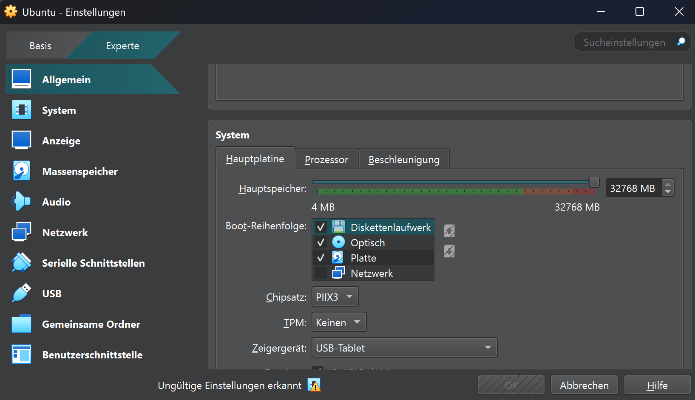
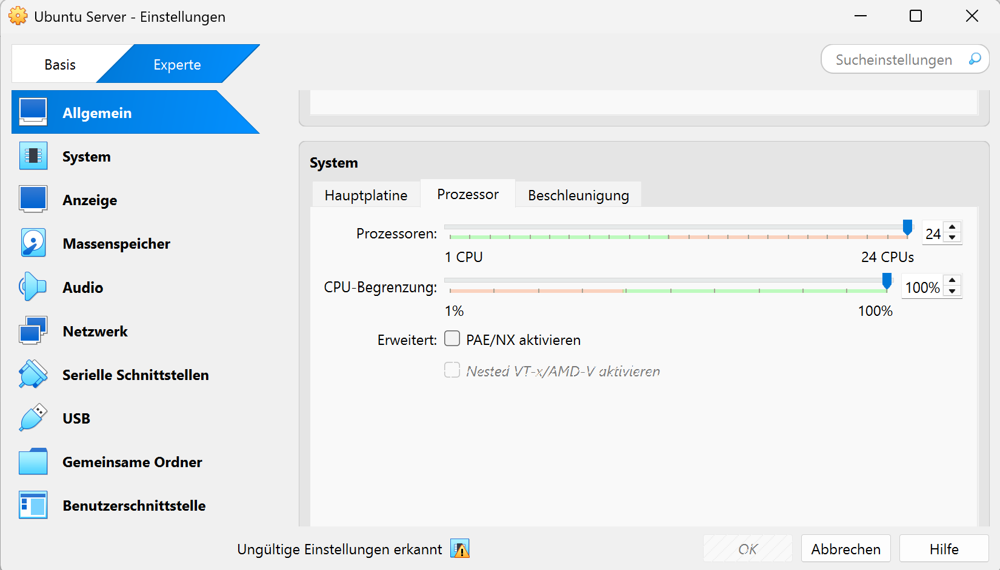

# KN 01 - Virtualisierung

## Hypervisor

Ein Hypervisor ist ein Programm, das auf einem Computer läuft und mehrere virtuelle Computer laufen lassen kann. Jede VM hat ein eigenes Betriebssystem und eigene Programme.

**Es gibt zwei Typen:**

### Hypervisor Typ 1
- Läuft direkt auf der Hardware
- Hohe Performance
- Direktzugriff auf Ressourcen
- Für Server

**Beispiele:**
- VMware ESXi
- Microsoft Hyper-V

### Hypervisor Typ 2
- Läuft auf einem Host Betriebssystem
- Einfach zu installieren
- Abhängig (Programm)
- Für Desktop

**Beispiele:**
- Oracle VirtualBox
- VMware Workstation

## Virtualisierungssoftware

Ich vermute das ich Hypervisor Typ 2 habe, weil ich VirtualBox benutze. Es läuft auf mein Host-System als Programm.

**Mein System:**

| Ressource | Mein Wert |
|-----------|-----------------|
| RAM       | 16 GB           |
| CPU       | 8 Logikprozessoren |

**RAM erhöhern über Systemmaximum**

Die OK-Option wird ausgeblendet. Wir können nicht weiter machen.

**CPU erhöhern über Systemmaximum**

Die OK-Option wird ebenfalls ausgeblendet. Wir können nicht weiter machen.

Warum geht das nicht?

## Erklärung

Der RAM un CPU sind eine feste, physische Ressource.
Deshalb kann die VM nur so viel RAM und CPU nutzen, wie der Host tatsächlich hat.

## Fazit

Dies zeigt, dass bei mir ein **Hypervisor Typ 2** eingesetzt wird.