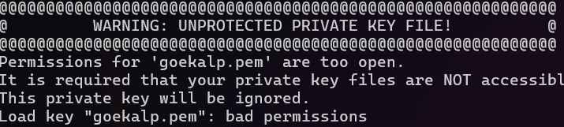

# KN 02 - Virtuelle Server

## Instanz erstellen

Ich erstellte ein Instanz:

| Eigenschaft       | Wert         |
|-------------------|--------------|
| Volumengrösse      | 8 GiB        |
| Plattform         | Linux/UNIX   |
| Anzahl der vCPUs  | 2            |
| RAM               | ?            |

## Zugriff mit SSH-Key

Ich erstelte ja zwei Keys. `eron.pem` und `goekalp.pem`. (Instanz benutzt `goekalp.pem`)

Es sollte dann nur `goekalp.pem` akzeptieren.

Ich habe aber ein Problem. Es verweigert meine Files:

 

Ich musste noch die permissions bearbeiten, damit es mich lässt die Schlüssel zu benutzen.
~~~
icacls "eron.pem" /inheritance:r
icacls "eron.pem" /grant:r "%USERNAME%:R"
icacls "goekalp.pem" /inheritance:r
icacls "goekalp.pem" /grant:r "%USERNAME%:R"
~~~

Jetzt kann ich die benutzen.

### Zugriff verweigert

`ssh -i eron.pem ubuntu@54.80.181.75 -o ServerAliveInterval=30`

### Zugriff gewährt

`ssh -i goekalp.pem ubuntu@54.80.181.75 -o ServerAliveInterval=30`

### Key

