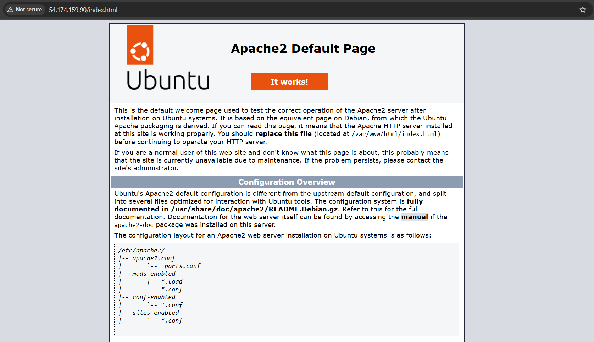
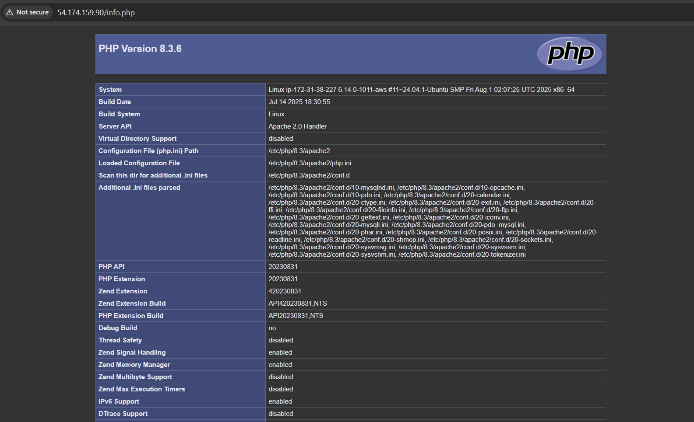
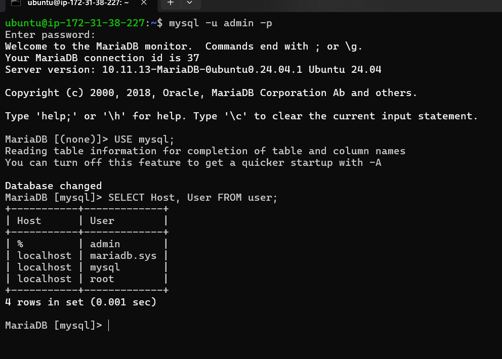

# KN 03

## Schritte

```bash
# Paketlisten aktualisieren
sudo apt update

# Apache Webserver installieren
sudo apt install apache2

# PHP installieren
sudo apt install php libapache2-mod-php

# MariaDB Datenbankserver installieren
sudo apt install mariadb-server

# PHP-MySQL Modul installieren
sudo apt install php-mysqli

# Benutzer "admin" mit Passwort erstellen
sudo mysql -sfu root -e "GRANT ALL ON *.* TO 'admin'@'%' IDENTIFIED BY 'Password' WITH GRANT OPTION;"

# Dienste neu starten
sudo systemctl restart mariadb.service
sudo systemctl restart apache2
```

## Screenshots

### Regeln setzen
Ich öffne die eingehende Ports für SSH und HTTP


### Aktive Regeln
Hier zeigt es jetzt die geöffnete Ports an.


### Apache



### PHP



### MariaDB Benutzer


### MariaDB Benutzer (Terminal)

