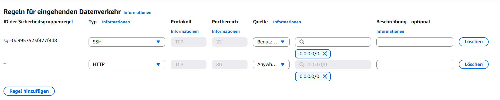
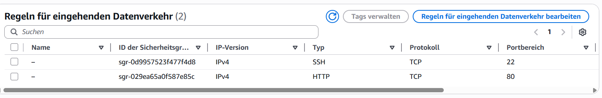
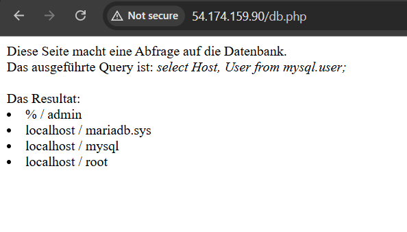

# KN 03 – LAMP Installation

## Schritte

```bash
# Paketlisten aktualisieren
sudo apt update

# Apache Webserver installieren
sudo apt install apache2

# PHP installieren (inkl. Apache-Modul)
sudo apt install php libapache2-mod-php

# MariaDB Datenbankserver installieren
sudo apt install mariadb-server

# PHP-MySQL Modul installieren
sudo apt install php-mysqli

# Benutzer "admin" mit Passwort erstellen (Passwort anpassen!)
sudo mysql -sfu root -e "GRANT ALL ON *.* TO 'admin'@'%' IDENTIFIED BY 'MEIN_PASSWORT' WITH GRANT OPTION;"

# Dienste neu starten
sudo systemctl restart mariadb.service
sudo systemctl restart apache2
```

## Screenshots

### Regeln setzen


### Aktive Regeln


### MariaDB Benutzer
