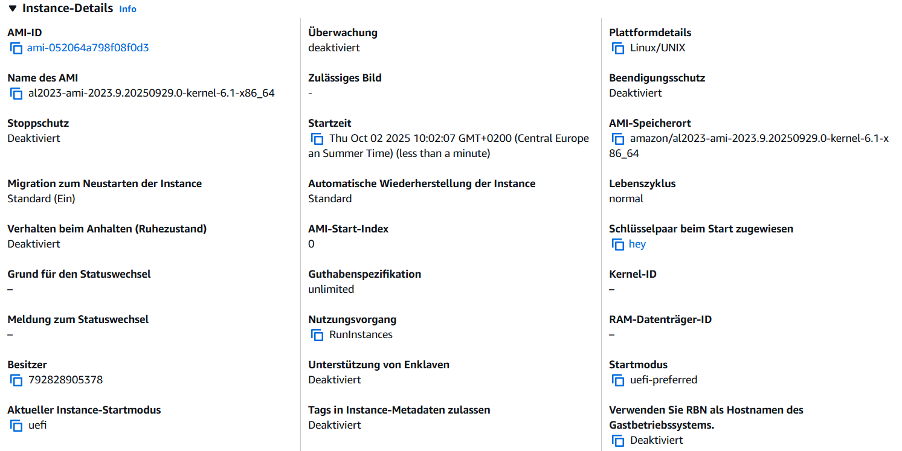
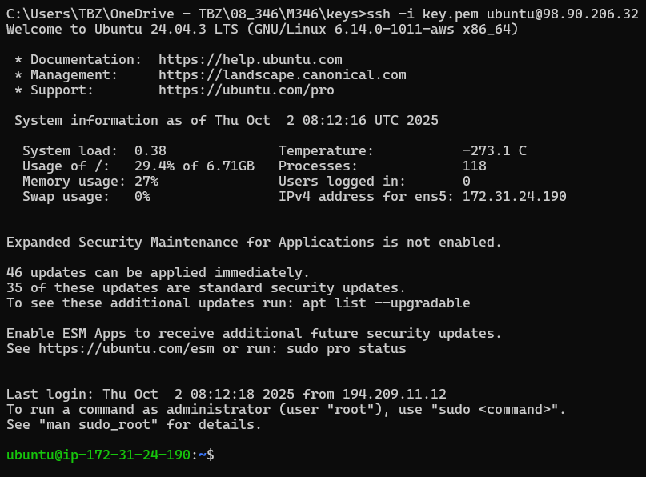
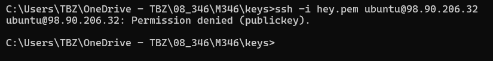
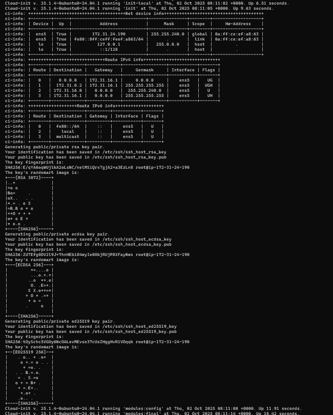
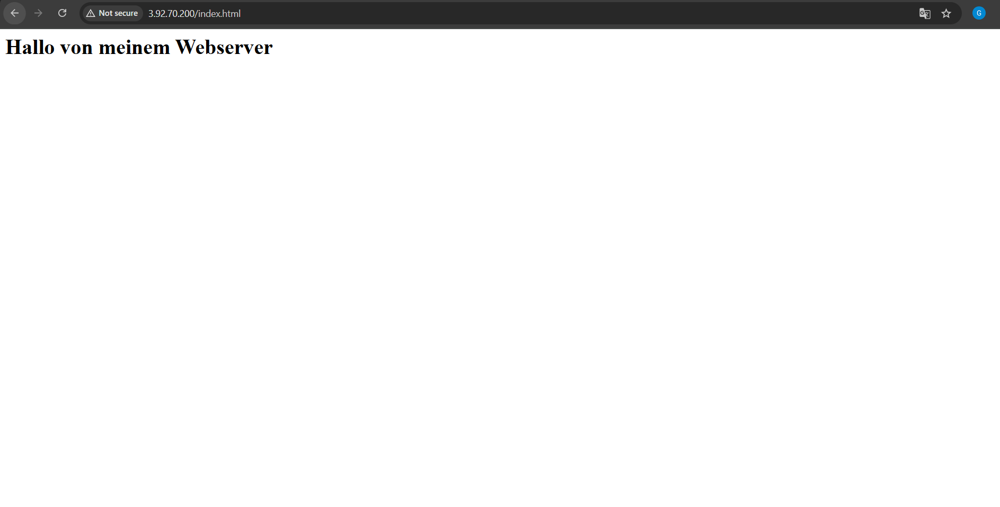
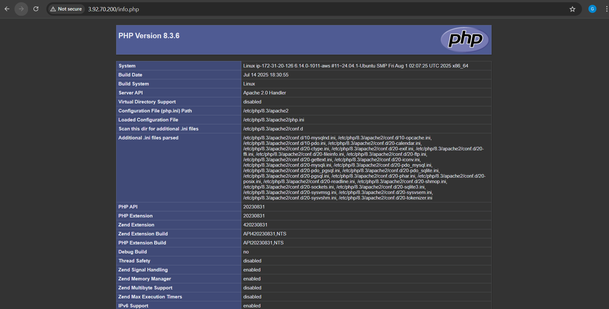

# KN 04

# A.

### Cloud-Config

~~~yaml
#cloud-config
users:
  - name: ubuntu
    groups: [users, admin]
    shell: /bin/bash
    sudo: ALL=(ALL) NOPASSWD:ALL
    ssh_authorized_keys:
      - ssh-rsa AAAAB3NzaC1yc2EAAAADAQABAAABAQC0WGP1EZykEtv5YGC9nMiPFW3U3DmZNzKFO5nEu6uozEHh4jLZzPNHSrfFTuQ2GnRDSt+XbOtTLdcj26+iPNiFoFha42aCIzYjt6V8Z+SQ9pzF4jPPzxwXfDdkEWylgoNnZ+4MG1lNFqa8aO7F62tX0Yj5khjC0Bs7Mb2cHLx1XZaxJV6qSaulDuBbLYe8QUZXkMc7wmob3PM0kflfolR3LE7LResIHWa4j4FL6r5cQmFlDU2BDPpKMFMGUfRSFiUtaWBNXFOWHQBC2+uKmuMPYP4vJC9sBgqMvPN/X2KyemqdMvdKXnCfrzadHuSSJYEzD64Cve5Zl9yVvY4AqyBD aws-key
ssh_pwauth: false
disable_root: false
package_update: true
packages:
  - curl
  - wget
~~~

### Cloud-Config Erklärung

Diese Cloud-Config macht Folgendes:

- users: legt alle Benutzer an
- name: Benutzername
- sudo: welche Befehle der Benutzer mit `sudo` ausführen darf
- groups: die Gruppen der Benutzer drinnen ist
- home: persönliche Ordner des Benutzers
- shell: welche Shell der Benutzer nutzt
- ssh_authorized_keys: öffentliche SSH-Schlüssel
- ssh_pwauth: legt fest, ob man sich mit Passwort anmelden darf
- disable_root: bestimmt, ob der Root-Account deaktiviert ist
- package_update: aktualisiert die Paketlisten
- packages: Liste von Packages die an will

# B.

## Public Key kriegen

```bash
icacls key.pem /inheritance:r /grant:r "%USERNAME%:F"
icacls hey.pem /inheritance:r /grant:r "%USERNAME%:F"

ssh-keygen -y -key.pem > key.pub
ssh-keygen -y -f hey.pem > hey.pub
```

Ich setze den key `hey` im AWS selber

und den key `key` im cloud-config.yaml:

[cloud-config.yaml](files/cloud-config-b.yaml)

Instanz Details:



**Es geht nur `key`, weil cloud-config.yaml den anderen überschreibt. Cloud-config nimmt priorität.**

`ssh -i key.pem ubuntu@98.90.206.32` Gewährt

 

`ssh -i hey.pem ubuntu@98.90.206.32` Verweigert



`sudo cat /var/log/cloud-init-output.log`



# C.

[cloud-config.yaml](files/cloud-config-c.yaml)

# D.

[cloud-init-db.yaml](files/cloud-init-db.yaml)

[cloud-init-web.yaml](files/cloud-init-web.yaml)


**index.html**



**info.php**



**db.php**

s