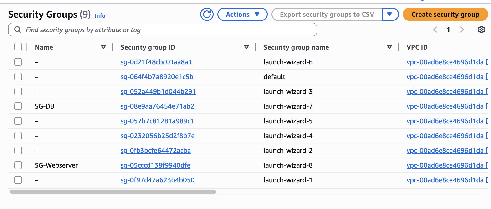

# KN05 – Netzwerk und Sicherheit

## A – Grundlagen

### Virtual Private Cloud (VPC)
Eine **VPC (Virtual Private Cloud)** ist ein logisch isoliertes, privates Netzwerk innerhalb einer öffentlichen Cloud-Umgebung.
Sie ermöglicht die Kontrolle über IP-Adressbereiche, Subnetze und Routing-Regeln.

### Subnetz (Subnet)
Ein **Subnetz** ist ein Teilnetz innerhalb einer VPC.
Die **Subnetzmaske** teilt eine IP-Adresse in einen **Netzwerkanteil** und einen **Hostanteil**. Dadurch können größere Netzwerke in kleinere logische Segmente unterteilt werden.

### IP-Typen
- **Öffentliche IP:** Von außen über das Internet erreichbar
- **Private IP:** Nur intern im Netzwerk erreichbar
- **Statische IP:** Bleibt dauerhaft gleich, auch nach Neustarts oder Änderungen

---

## 2. Analyse der bestehenden Netzwerke

### VPC
- **CIDR-Block:** `172.31.0.0/16`
  → Adressbereich: `172.31.0.0` bis `172.31.255.255`

### Subnetze
Vorhandene Subnetze innerhalb der VPC:

- `172.31.0.0/20`
- `172.31.16.0/20`
- `172.31.32.0/20`
- `172.31.48.0/20`
- `172.31.64.0/20`
- `172.31.80.0/20`

**Erklärung:**  
Jedes Subnetz ist ein `/20`-Block innerhalb des gesamten `/16`-Adressraums und deckt damit verschiedene Teilbereiche der VPC ab.

---

## 4. Private IPs für KN05-Instanzen

### Subnetz für KN05
- **Subnetz:** `172.31.64.0/20`
- **Verwendbarer IP-Bereich:** `172.31.64.4` – `172.31.79.254`
  (AWS reserviert die ersten vier und die letzte Adresse des Subnetzes.)

**Bedingung:**
Die letzte Oktette der IP-Adresse muss durch 10 teilbar sein.

| Instanz    | Private IP   |
|-------------|--------------|
| Webserver   | 172.31.64.10 |
| Datenbank   | 172.31.64.20 |

Beide Adressen liegen im gültigen Bereich und erfüllen die Teilbarkeitsregel.

---

## B – Objekte und Instanzen

### Sicherheitsgruppen
Zwei Sicherheitsgruppen wurden erstellt:

- **SG-Webserver:**
  - Eingehend: HTTP (Port 80)
  - Eingehend: SSH (Port 22)

- **SG-Database:**
  - Eingehend: MariaDB (Port 3306) nur intern
  - Eingehend: SSH (Port 22)

**Screenshots:**
- 
- 
- 

---

### Statische IP
Eine **Elastic IP** wurde für den Webserver erstellt und zugewiesen:

- **Name:** IP-Web
- **Eigenschaft:** Bleibt auch nach Neustart bestehen

**Screenshot:**
- 

---

### Instanzen
Zwei Instanzen wurden erstellt:

- Verwendung des richtigen Subnetzes
- Manuell gesetzte private IPs
- Zuweisung der passenden Sicherheitsgruppen
- Elastic IP für Webserver konfiguriert

**Screenshots:**
- 
- 

---

## Funktionstest

Erfolgreiche Tests der Webanwendung:

- index.html – Startseite erreichbar
- info.php – PHP-Info geladen
- db.php – Verbindung zur Datenbank erfolgreich

**Screenshots:**
- 
- 
- 

---

## Hinweis

In allen Konfigurationsdateien muss stets die korrekte IP-Adresse der Datenbank eingetragen werden.