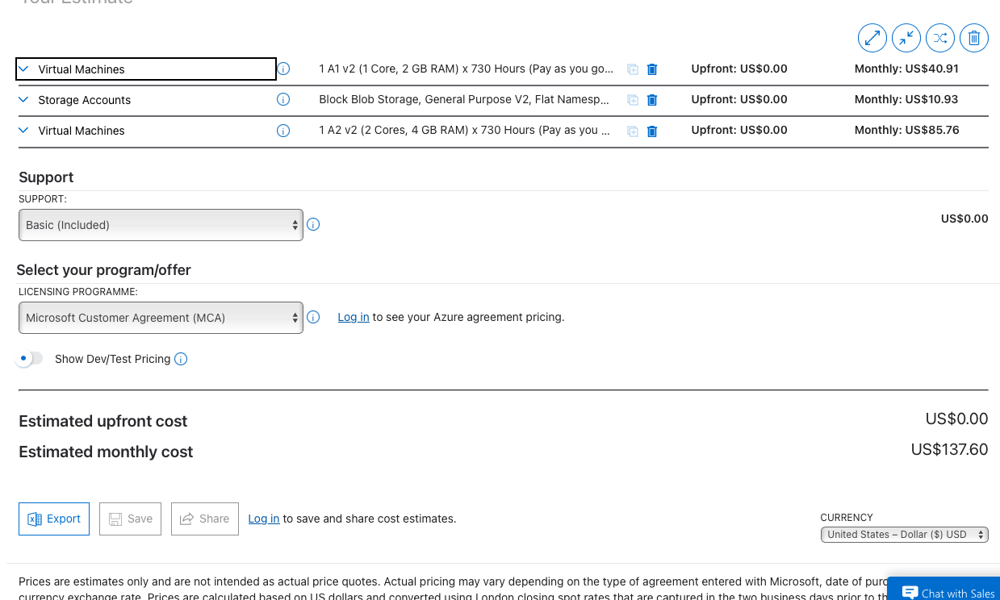
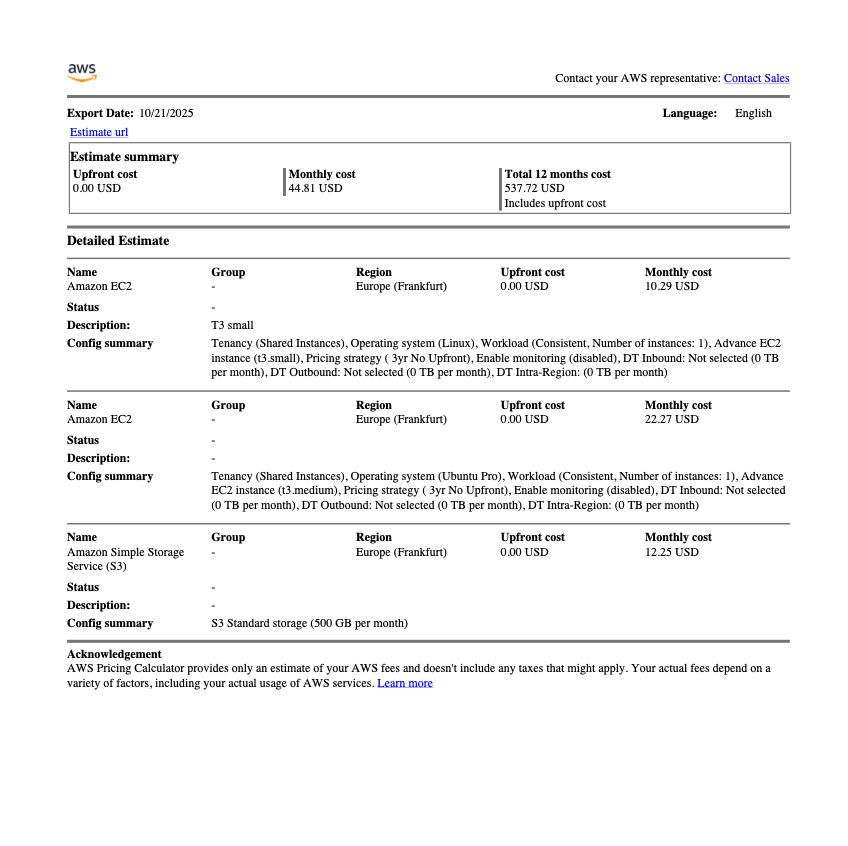
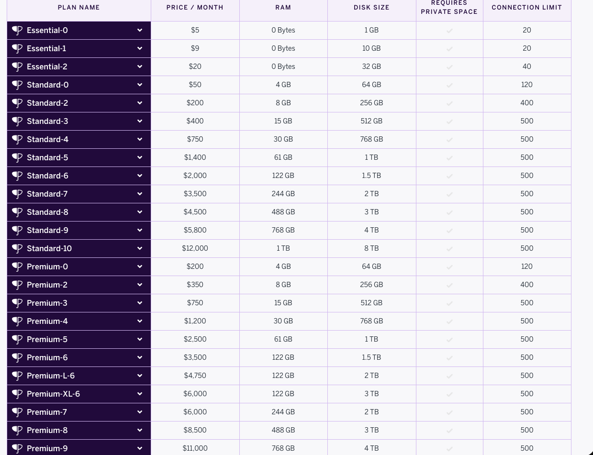
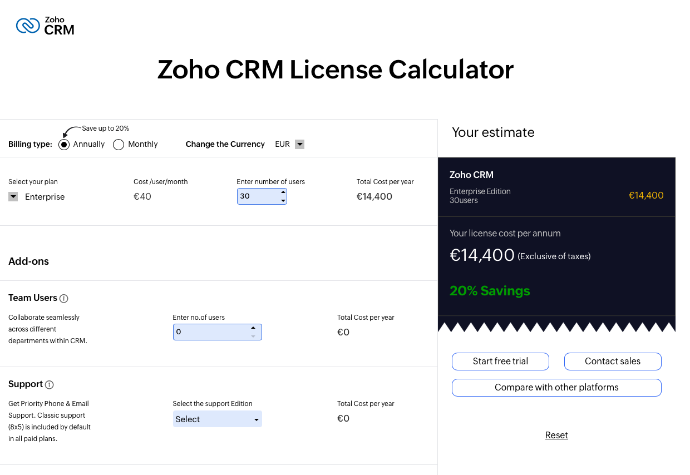
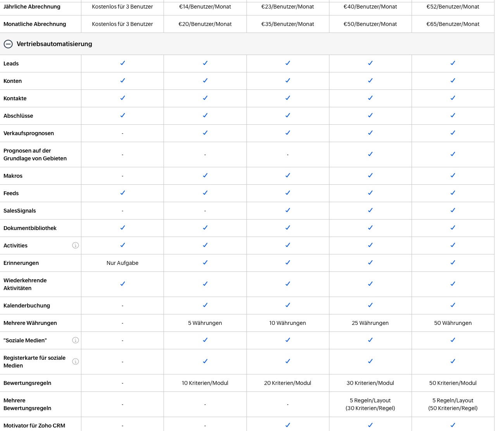
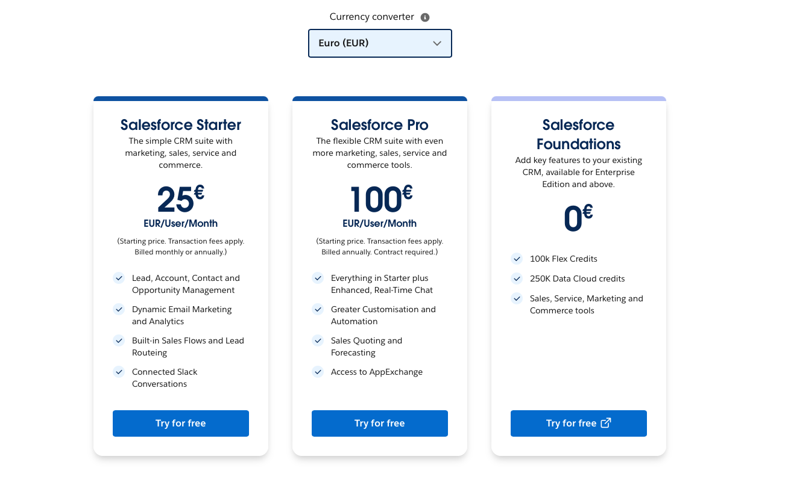

# KN10 Kostenrechnung

## Ausgangssituation

- **Webserver:** 1 Core, 20 GB Speicher, 2 GB RAM, Ubuntu  
- **DB-Server:** 2 Cores, 100 GB Speicher, 4 GB RAM, Ubuntu  
- **Backup:** Täglich 7 Tage, wöchentlich 1 Monat, monatlich 3 Monate  
- **Benutzer:** 30  
- **CEO:** technisch nicht sattelfest, braucht Unterstützung  

---

## Migrationsarten

### Rehosting (IaaS)
- **AWS / Azure** – ca. $138/Monat  
  + **Günstigste Lösung**  
  + Viel Kontrolle, ähnliches Setup wie On-Premise  
  + Weniger Anpassungen nötig  
  - Etwas mehr Wartung erforderlich  

**Warum diese Wahl:**  
- Webserver: 1 vCPU, 2 GB RAM, 20 GB SSD  
- DB-Server: 2 vCPU, 4 GB RAM, 100 GB SSD  
- Backup über Cloud-Snapshots  
- Einfach zu migrieren, da kaum Codeänderungen notwendig  

**Screenshot Kostenrechnung:**  

**Azure**  
  

**AWS**  
  

---

### Replatforming (PaaS)
- **Heroku** – ca. $250/Monat  
  + Einfach zu skalieren, weniger Wartung  
  - Plattformabhängig  
  - Code muss angepasst werden  

**Warum diese Wahl:**  
- Webdyno: 1 Standard-2X Dyno (entspricht Webserver)  
- DB: Heroku Postgres Standard-0 (entspricht DB-Server)  
- Backup über Heroku Backups  
- Etwas teurer, da Plattform-Grössen fest vorgegeben sind  

**Screenshot Kostenrechnung:**  

**Heroku**  
  
  

---

### Repurchasing (SaaS)
- **Zoho CRM** – ca. $40/Benutzer → $1200/Monat (bei 30 Benutzern)  
  + Sofort einsatzbereit, keine Wartung  
  - Eingeschränkte Anpassbarkeit  

- **Salesforce** – ca. $250/Benutzer → $7500/Monat (bei 30 Benutzern)  
  + Sehr umfangreiche Funktionen  
  - Sehr teuer, komplexe Einrichtung  

**Warum diese Wahl:**  
- Zoho: Standard-Plan, ausreichend für 30 Benutzer  
- Salesforce: Sales Cloud Professional, volle CRM-Funktionalität  
- Empfehlung: Zoho ist deutlich günstiger, aber immer noch teurer als IaaS/PaaS  

**Screenshots Pricing:**  

**Zoho**  
  
  

**Salesforce**  
  

---

## Kosten- und Arbeitsvergleich

| Option       | Kosten/Monat | Aufwand           |
|--------------|--------------|------------------|
| AWS / Azure  | $138         | 6–8 Wo. |
| Heroku       | $250         | 4–6 Wo. |
| Zoho CRM     | $1200        | 2–4 Wo. |
| Salesforce   | $7500        | 2–4 Wo. |

**Aufwand:**  
- **IaaS:** einfache Migration, wenig Anpassung nötig  
- **PaaS:** etwas Code-Anpassung, mittlerer Aufwand  
- **SaaS:** kaum technische Arbeit, aber Schulung und Datenübernahme  

**Zusätzliche Kosten:**  
- Personal für Migration/Schulung  
- Laufende Wartung (bei IaaS/PaaS)  
- Datenmigration und Integration  

---

## Empfehlung

**AWS / Azure (IaaS)**

- **Günstigste Lösung**  
- Leicht zu migrieren, da bestehende Umgebung fast übernommen werden kann  
- Gute Kontrolle über System und Daten  
- Wartung moderat, Backup automatisierbar  

---

## Erkenntnisse

- **IaaS:** günstig, flexibel, wenig Anpassungen nötig
- **PaaS:** teurer, aber einfache Wartung
- **SaaS:** am teuersten, aber kaum technischer Aufwand
- **Kostenunterschiede:** IaaS deutlich günstiger; SaaS hauptsächlich Lizenzkosten  
- **Aufwand:** IaaS < PaaS < SaaS

**Fazit:**
Für kleine und mittlere Firmen mit bestehenden Systemen und begrenztem Budget ist **IaaS (AWS oder Azure)** die beste Wahl – kostengünstig, kontrollierbar und leicht migrierbar.